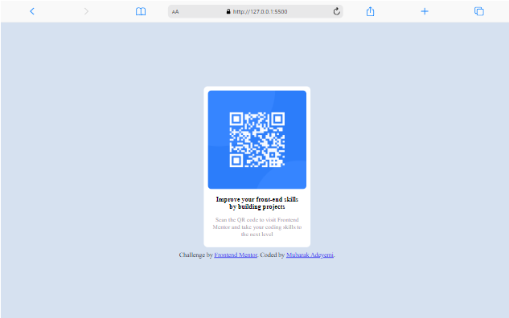
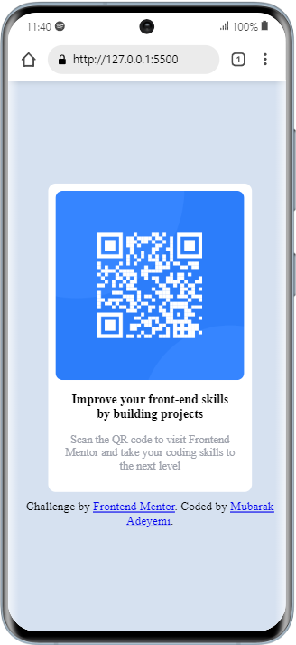

# Frontend Mentor - QR code component solution

This is a solution to the
[QR code component challenge on Frontend Mentor](https://www.frontendmentor.io/challenges/qr-code-component-iux_sIO_H).
Frontend Mentor challenges help you improve your coding skills by building
realistic projects.

## Table of contents

- [Overview](#overview)
  - [Screenshot](#screenshot)
  - [Links](#links)
- [My process](#my-process)
  - [Built with](#built-with)
  - [What I learned](#what-i-learned)
  - [Continued development](#continued-development)
  - [Useful resources](#useful-resources)
- [Author](#author)

## Overview

### Screenshot




### Links

- Solution URL:
  [https://github.com/Mubarak-Adeyemi/QR-code-component-coding-challenge.git]
- Live Site URL:
  [https://mubarak-adeyemi.github.io/QR-code-component-coding-challenge/]

## My process

### Built with

- Semantic HTML5 markup
- CSS custom properties
- Flexbox

### What I learned

I learnt the useage of:

- div element
- css flexbox

```html
<div class="qr-code">
  <div class="qr-coontainer">
    
  </div>
  <div class="texts">
    <div class="head-text">
      <h2>Improve your front-end skills by building projects</h2>
    </div>
    <div class="body-text">
      <p>
        Scan the QR code to visit Frontend Mentor and take your coding skills to
        the next level
      </p>
    </div>
  </div>
</div>
```

```css
body {
  width: 100vw;
  height: 100vh;
  display: flex;
  flex-direction: column;
  justify-content: center;
  align-items: center;
  background-color: #d6e1f0;
}
```

### Continued development

I'd like to dive deeper into flex and grid layout.

### Useful resources

- [MDN DEVELOPER](https://developer.mozilla.org/en-US/docs/Web/CSS/CSS_flexible_box_layout/Basic_concepts_of_flexbox) -
  I was able to understand the fundamentals of CSS FLEX through this MDN DOCS.

- [CSS TRICKS](https://css-tricks.com/snippets/css/a-guide-to-flexbox/) - This
  is an amazing article which helped me finally understand FLEXBOX LAYOUT. I'd
  recommend it to anyone still learning this concept.

## Author

- Website - [Mubarak Adeyemi](https://mubarak-adeyemi.github.io/Portfolio/)
- Frontend Mentor -
  [@Mubarak-Adeyemi](https://www.frontendmentor.io/profile/Mubarak-Adeyemi)
